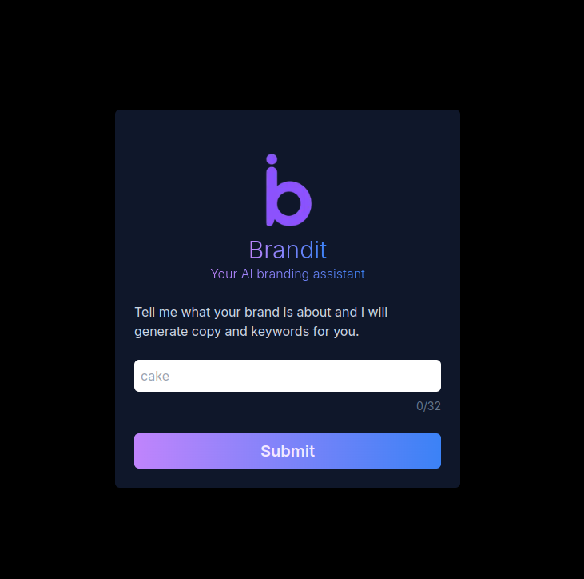
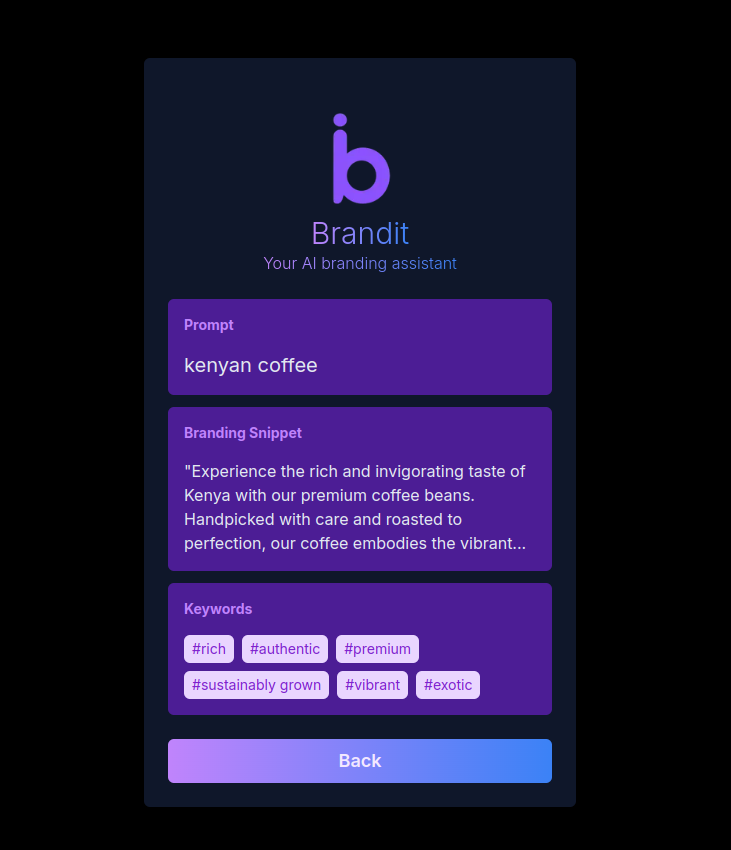

# BrandIt
AI-powered marketing copy generator built with Next.js and AWS serverless infrastructure.

[](https://brandit-beta.vercel.app/)
[](https://www.typescriptlang.org/)
[](https://nextjs.org/)
[](https://aws.amazon.com/)

## Overview

BrandIt is an AI-powered platform that generates professional marketing copy using OpenAI's GPT models. Users input brand details (target audience, tone, keywords) and receive instant, customized marketing content.

**Built to demonstrate:**
- AI API integration (OpenAI GPT-3.5/4)
- AWS serverless architecture (Lambda, API Gateway, DynamoDB)
- Infrastructure as Code (AWS CDK)
- Full-stack TypeScript development

**Live Demo:** [brandit-beta.vercel.app](https://brandit-beta.vercel.app/)

---

## Screenshots

### Home Page
[](assets/home-page-screenshot.png)

*User inputs brand details for AI-generated copy*

### Results Page
[](assets/results-page-screenshot.png)

*AI-generated marketing copy and keywords*

---

## Tech Stack

**Frontend:**
- Next.js 14 (React)
- TypeScript
- Tailwind CSS
- Deployed on Vercel

**Backend:**
- Python 3.9 with FastAPI
- AWS Lambda (serverless compute)
- AWS API Gateway (HTTP routing)
- DynamoDB (generation history storage)
- AWS CDK (infrastructure as code)

**AI:**
- OpenAI API (GPT-3.5/4)

---

## Architecture
```
User Input → Next.js Frontend → API Gateway → Lambda (Python/FastAPI)
                                                 ↓
                                            OpenAI API
                                                 ↓
                                        DynamoDB (history) → Response
```

**Key Technical Decisions:**
- **Serverless architecture** for automatic scaling and cost efficiency
- **AWS CDK** for version-controlled infrastructure
- **DynamoDB** for fast, scalable NoSQL storage
- **Streaming responses** to handle variable OpenAI API latency (100ms-5s)
- **Rate limiting** to prevent API cost abuse

---

## Features

- Instant AI-generated marketing copy (taglines, descriptions, social posts)
- Brand-specific prompt engineering for consistent voice
- Generation history stored per user
- Responsive UI with real-time loading states
- Cost-optimized with caching and rate limiting

---

## Running Locally

### Prerequisites
- Node.js 18+
- Python 3.9+
- AWS Account (for backend deployment)
- OpenAI API key

### Frontend Setup
```bash
cd brandit-site
npm install
npm run dev
```
Visit `http://localhost:3000`

### Backend Deployment
```bash
cd brandit-infrastructure
npm install
npm run build
npx cdk deploy
```

### Environment Variables
Create `.env.local` in `brandit-site/`:
```
OPENAI_API_KEY=your_openai_key
AWS_API_ENDPOINT=your_api_gateway_url
```

---

## Project Structure
```
brandit/
├── brandit-site/          # Next.js frontend
├── brandit-infrastructure/ # AWS CDK infrastructure
├── app/                    # Python Lambda backend (FastAPI)
└── assets/                 # Screenshots
```

---

## What I Learned

- Integrating OpenAI API with streaming responses for better UX
- Deploying serverless infrastructure with AWS CDK
- Managing AI API costs with caching and rate limiting
- Building type-safe full-stack apps (TypeScript + Python type hints)
- Infrastructure as Code best practices

---

## Future Improvements

- User authentication and team collaboration
- A/B testing framework for generated copy
- Version history with rollback capability
- Analytics dashboard for copy performance tracking
- Multi-language support

